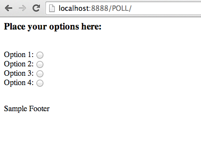
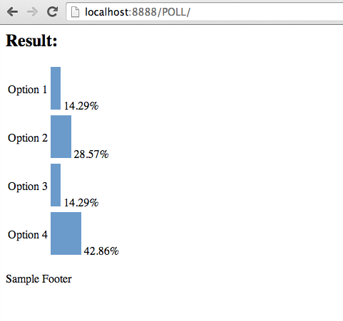

ajaxpoll
========

A simple AJAX polling script

Live Demo : [Click Here](http://dhamaniasad.github.io/ajaxpoll/)

### Screenshots
***




### Setting up on Linux server
***
Use my script [here](https://github.com/dhamaniasad/lowendscript) to easily set up a LEMP server to host the polling script on a VPS. If you want to host this script on a shared hosting account, it is as easy as uploading all the relevant files to a directory in your web root folder.

These are the files you must place in your web folder(public_html | /var/www/ | /usr/share/nginx/html | etc.)

```
index.html
poll.gif
poll_result.txt
poll_vote.php
style.css
```
